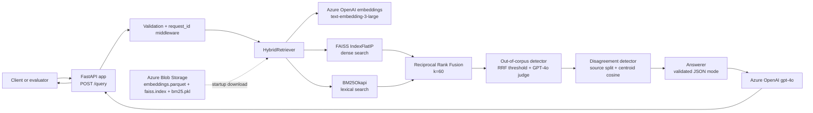
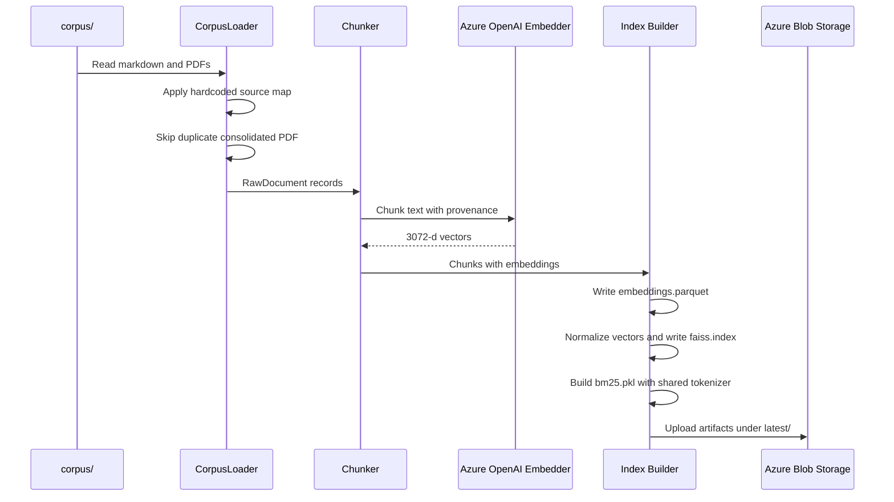
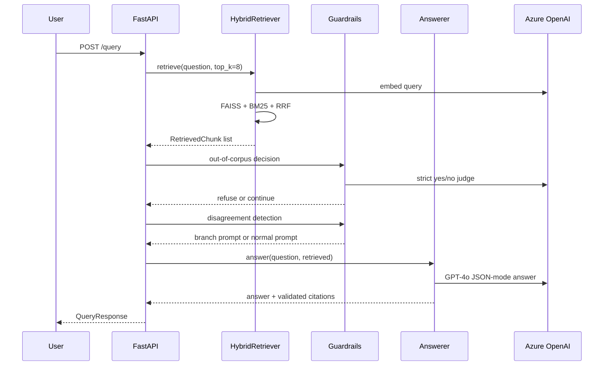

# Refreshworks AI HR Policy RAG

Production-shaped retrieval-augmented generation over two real HR handbooks: OpenGov Foundation (US) and Made Tech (UK). The API answers employee policy questions with citations, refuses out-of-corpus requests, and explicitly surfaces disagreements when both handbooks cover the same topic differently.

This repository started from the Refreshworks SDK template, but replaces the Azure Functions runtime with a FastAPI container while preserving the SDK's core intent: stable retrieval/generation abstractions, explicit provenance, and deployment to Azure.

## 1. Overview And Current Status

The system ingests 32 source files from `corpus/`: 24 markdown files and 8 PDFs. One duplicate consolidated PDF is skipped at ingestion, so the searchable index contains 31 documents and 51 final chunks:

| Source | Indexed Chunks |
|---|---:|
| OpenGov Foundation | 22 |
| Made Tech | 29 |

The current local RAG stack is fully implemented and evaluated:

| Capability | Status |
|---|---|
| FastAPI `/query` endpoint | Implemented |
| Markdown + PDF loading | Implemented |
| Header-aware and PDF paragraph chunking | Implemented |
| Azure OpenAI embeddings | Implemented |
| FAISS dense index | Implemented |
| BM25 lexical index | Implemented |
| RRF hybrid retrieval | Implemented |
| GPT-4o grounded generation | Implemented |
| Citation validation | Implemented |
| Out-of-corpus refusal | Implemented |
| Multi-source disagreement handling | Implemented |
| Evaluation harness | Implemented |
| Structured JSON logging | Implemented |
| Azure Monitor OpenTelemetry wiring | Implemented locally, live verification blocked by RBAC |
| Real RAG Azure Container Apps deployment | Scripted, blocked by RBAC |

Live deployed URL for demo fallback:

```text
https://hr-rag-stub.lemonisland-a021bbbf.swedencentral.azurecontainerapps.io
```

Important: this URL is the Phase 3 stub deployment. It proves the Azure Container Apps build/deploy path works, but it does not serve the final RAG pipeline. The real app deployment script exists as `deploy/deploy.sh`, but the Azure account available during implementation lacked `Microsoft.Authorization/roleAssignments/write`, so the user-assigned managed identity could not be granted Blob/ACR RBAC roles. The real deployment is therefore documented as blocked, not silently claimed as complete.

## 2. Architecture And Phase Walkthrough

Runtime request path:



Ingestion path:



Runtime query path:



Phase overview:

| Phase | What Changed | Current Status |
|---|---|---|
| 1 Setup and Azure access | Azure account, resource group, OpenAI resource, local env setup | Completed by project owner |
| 2 Repo scaffolding and SDK exploration | Mapped SDK core abstractions, Azure Functions glue, Qdrant coupling | Completed |
| 3 Deployable skeleton | FastAPI app, Dockerfile, stub Container Apps deployment | Completed; stub URL live |
| 4 Corpus loading | `RawDocument`, hardcoded source mapping, duplicate skip, PDF fallback extraction | Completed |
| 5 Chunking | Header-aware markdown chunks, PDF paragraph packing, token counts, metadata | Completed |
| 6 Embeddings and indexes | Azure embeddings, FAISS, BM25, parquet, Blob persistence | Completed |
| 7 Retrieval | Dense + lexical retrieval with shared tokenizer and RRF fusion | Completed |
| 8 Generation and citations | GPT-4o answerer, prompt, JSON mode, citation validation, real `/query` | Completed |
| 9 Guardrails | Out-of-corpus detector, disagreement detector, prompt branching | Completed |
| 10 Evaluation | 40-case test set, runner, report, quality bar | Completed |
| 11 Real deployment | Managed identity, Blob-backed startup, Container Apps secret refs | Scripted but RBAC-blocked |
| 12 Observability and polish | JSON logs, request IDs, Azure Monitor OpenTelemetry wiring | Implemented locally; live telemetry blocked by Phase 11 RBAC |

## 3. Decisions Summary

Full reasoning lives in [DECISIONS.md](DECISIONS.md). The short version:

| Decision | Summary |
|---|---|
| D-01 Compute target | Use Azure Container Apps because the assignment requires it. |
| D-02 Web framework | Use FastAPI for Pydantic validation, clean routing, and container-friendly runtime. |
| D-03 Vector store | Use in-memory FAISS persisted as `embeddings.parquet`, `faiss.index`, and `bm25.pkl`. |
| D-04 Embedding model | Use Azure OpenAI `text-embedding-3-large` because it is provided and high-quality. |
| D-05 LLM | Use Azure OpenAI `gpt-4o` for final grounded answers. |
| D-06 Markdown chunking | Use heading-aware markdown chunking with breadcrumbs. |
| D-07 PDF chunking | Use paragraph packing with form-feed page markers for PDFs. |
| D-08 Chunk size | Use 800 max tokens, 100 overlap, 50 min section tokens. |
| D-09 Tiny/duplicate files | Keep tiny files whole and skip the duplicate OpenGov consolidated PDF. |
| D-10 Retrieval | Use FAISS + BM25 fused by Reciprocal Rank Fusion. |
| D-11 `top_k` | Retrieve 8 chunks for guardrails and present 4 to generation. |
| D-12 Citations | Return structured citations and drop hallucinated citation keys. |
| D-13 Out-of-corpus handling | Refuse only when score threshold and GPT-4o judge agree. |
| D-14 Disagreement handling | Detect multi-source topic overlap and inject compare/attribute instructions. |
| D-15 Evaluation | Use a hand-crafted 40-case harness with explicit quality bars. |
| D-16 Secrets and Blob auth | Use Container Apps secrets for OpenAI and managed identity for Blob reads. |

## 4. Quick Start Local

Prerequisites:

- Python 3.11
- Conda or another virtual environment manager
- Azure OpenAI endpoint/key in `.env`
- Azure CLI login only if uploading/downloading Blob artifacts

Clone and set up:

```bash
git clone https://github.com/Mehulupase01/RAG-implementation-Refreshworks-Mehul.git
cd RAG-implementation-Refreshworks-Mehul

conda create -n rag python=3.11
conda activate rag
pip install -r requirements.txt

cp .env.example .env
```

Fill `.env`:

```text
AZURE_OPENAI_ENDPOINT=...
AZURE_OPENAI_KEY=...
AZURE_OPENAI_API_VERSION=2024-10-21
AZURE_OPENAI_CHAT_DEPLOYMENT=gpt-4o
AZURE_OPENAI_EMBEDDING_DEPLOYMENT=text-embedding-3-large
BLOB_ACCOUNT_URL=https://stragragintvwmehul.blob.core.windows.net/
BLOB_INDEX_CONTAINER=rag-index
INDEX_BLOB_PREFIX=latest
INDEX_LOCAL_DIR=data/index
APPLICATIONINSIGHTS_CONNECTION_STRING=
```

Build the local index:

```bash
python -m app.ingest
```

Run the API:

```bash
uvicorn app.main:app --host 127.0.0.1 --port 8000
```

Try it:

```bash
curl -X POST http://127.0.0.1:8000/query \
  -H "Content-Type: application/json" \
  -d "{\"question\":\"How many sick days do I get?\"}"
```

Health endpoints:

```bash
curl http://127.0.0.1:8000/healthz
curl http://127.0.0.1:8000/readyz
```

Run tests:

```bash
pytest tests -q
```

## 5. Deploy From Scratch

Deployment target:

- Resource group: `rg-rag-interview-mehul`
- Region: `swedencentral`
- ACR prefix: `acrragintvwmehul`
- Container Apps environment: `cae-rag-interview`
- Stub app: `hr-rag-stub`
- Real RAG app: `hr-rag-app`
- Storage container: `rag-index`
- Managed identity: `id-rag-app`
- App Insights: `appi-rag-interview`

Script sequence:

```bash
# 1. Create StorageV2 account and private rag-index container.
bash deploy/setup-storage.sh

# 2. Build local retrieval artifacts and upload them to Blob if BLOB_ACCOUNT_URL is set.
python -m app.ingest

# 3. Create/reuse user-assigned identity and grant Blob read access.
bash deploy/setup-rbac.sh

# 4. Build image in ACR and create/update the real Container App.
bash deploy/deploy.sh
```

What `deploy/deploy.sh` does:

- Builds the Docker image in ACR with `az acr build`.
- Creates/reuses Application Insights.
- Runs `setup-rbac.sh`.
- Attaches the user-assigned identity to the Container App.
- Uses the identity for ACR pulls.
- Stores the OpenAI key as a Container Apps secret.
- Sets `AZURE_OPENAI_KEY=secretref:openai-key`.
- Sets Blob/index env vars including `INDEX_LOCAL_DIR=/tmp/index`.
- Checks `/healthz` and `/readyz`.
- Dumps the last 50 Container App logs on failure.

Known deployment roadblock:

The implementation reached ACR build and Blob upload successfully, but the Azure account used during this build could not create role assignments:

```text
Microsoft.Authorization/roleAssignments/write denied for upasemehul@gmail.com
```

That blocks:

- assigning `Storage Blob Data Reader` to `id-rag-app` for the `rag-index` container
- assigning `AcrPull` to `id-rag-app` for ACR image pulls
- completing the real `hr-rag-app` deployment
- verifying App Insights traces from the live real app

The fix is to have an Owner or User Access Administrator grant the required RBAC assignments, or temporarily grant that permission to the deployment account. Until then, the Phase 3 stub URL remains the live demo URL for the container pipeline, while the real RAG is validated locally.

## 6. Evaluation Instructions

The evaluation set is hand-written and stored at:

```text
eval/test_set.json
```

It contains exactly 40 cases:

| Category | Count |
|---|---:|
| Verbatim | 5 |
| Paraphrased | 5 |
| Single-source factual | 6 |
| Source disagreement | 8 |
| Single-source-only | 4 |
| Clearly out-of-corpus | 5 |
| Plausibly out-of-corpus | 4 |
| Adversarial | 3 |

Quality bar:

| Metric | Bar | Latest Local Result |
|---|---:|---:|
| Retrieval recall | >= 0.85 | 0.982 |
| Refusal accuracy | >= 0.90 | 1.000 |
| Surfaces both sources | >= 0.75 | 1.000 |
| Mean faithfulness | >= 0.80 | 0.939 |
| Error rate | lower is better | 0.000 |

Latest local report:

- [eval/results.md](eval/results.md)
- [eval/results.json](eval/results.json)

Re-run against any API base URL:

```bash
python -m eval.run_eval \
  --base-url http://127.0.0.1:8000 \
  --test-set eval/test_set.json \
  --out eval/results.json \
  --report eval/results.md
```

Use the same command against a deployed URL:

```bash
python -m eval.run_eval \
  --base-url https://<container-app-fqdn> \
  --test-set eval/test_set.json \
  --out eval/results-live.json \
  --report eval/results-live.md
```

The harness records HTTP status, latency, answer, citations, retrieval scores, deterministic checks, and a strict GPT-4o faithfulness score for non-refusal cases. Known limitations are documented in the generated report.

## 7. Project Layout

```text
.
|-- app/                 FastAPI app, ingestion, retrieval, generation, guardrails, observability
|-- corpus/              HR policy corpus: OpenGov and Made Tech markdown/PDF sources
|-- data/index/          Local FAISS, BM25, and parquet retrieval artifacts
|-- deploy/              Azure setup, RBAC, and Container Apps deployment scripts
|-- eval/                40-case test set, eval runner, judge prompt, latest local results
|-- sdk/                 Refreshworks SDK template and planning docs kept for assignment context
|-- tests/               Unit, integration, retrieval, query, eval, and observability tests
|-- Chats/               Raw AI collaboration transcripts and exports
|-- AZURE_ACCESS.md      Azure sandbox details; no secrets committed
|-- CORPUS_SOURCES.md    Corpus provenance and hardcoded source mapping reference
|-- DECISIONS.md         Architecture decisions and trade-offs
|-- PROMPTS.md           Curated AI collaboration log
|-- Dockerfile           Multi-stage Python 3.11 production container
|-- requirements.txt     Pinned runtime/test/eval dependencies
```

Important API files:

| Path | Purpose |
|---|---|
| `app/main.py` | FastAPI factory, lifespan startup, index download/load, app state wiring |
| `app/api/query.py` | Real `/query` flow with retrieval, guardrails, generation, and safe structured logs |
| `app/ingest/loader.py` | Hardcoded corpus source attribution and PDF/markdown loading |
| `app/ingest/chunker.py` | Markdown/PDF chunking |
| `app/ingest/embedder.py` | Azure OpenAI embeddings wrapper with rate limiting and retries |
| `app/ingest/indexer.py` | Parquet, FAISS, and BM25 artifact builder |
| `app/retrieval/retriever.py` | Hybrid FAISS/BM25 retriever with RRF |
| `app/generation/answerer.py` | GPT-4o JSON-mode answer generation and citation validation |
| `app/guardrails/` | Out-of-corpus and disagreement detectors |
| `app/observability/` | JSON logging, request IDs, telemetry setup |

## 8. What I Would Do With Another Week

Ranked by practical impact:

1. Get Azure RBAC unblocked, complete the real `hr-rag-app` deployment, then run the eval suite against the live URL.
2. Move the OpenAI key to Key Vault references instead of Container Apps secrets for centralized rotation.
3. Add OAuth2/JWT auth and basic rate limiting before exposing `/query` outside an assignment sandbox.
4. Calibrate out-of-corpus thresholds with a larger in-corpus vs out-of-corpus score distribution.
5. Tune disagreement detection thresholds using the evaluation set and add more disagreement cases.
6. Run chunking experiments across `{400/50, 600/75, 800/100, 1000/125}` and report retrieval/faithfulness curves.
7. Add a cross-encoder reranker over the fused top 20 results for better precision.
8. Expand evaluation beyond 40 cases and cross-check with RAGAS or DeepEval.
