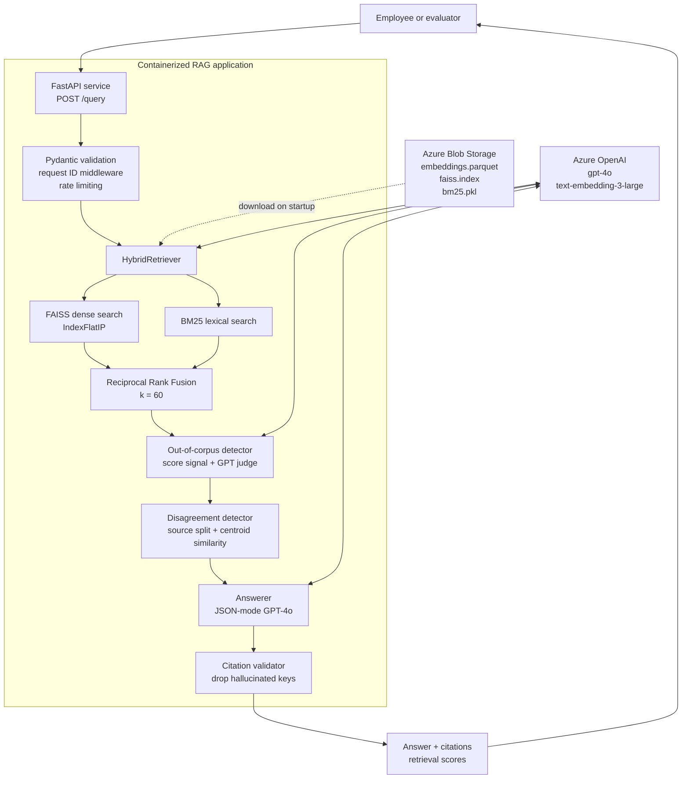
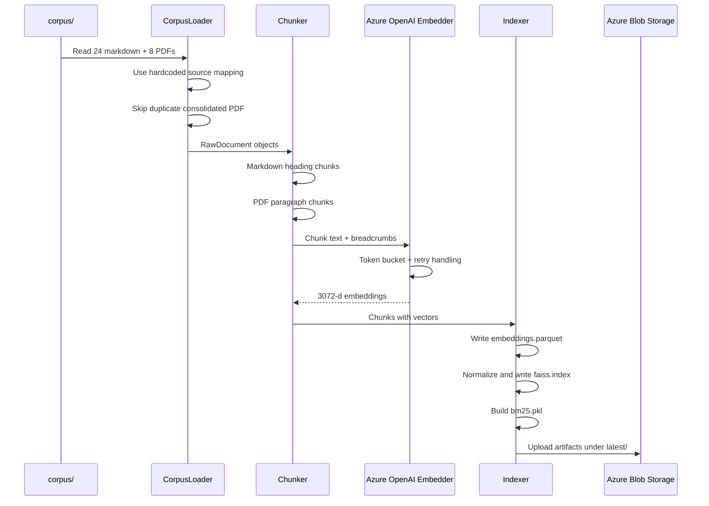
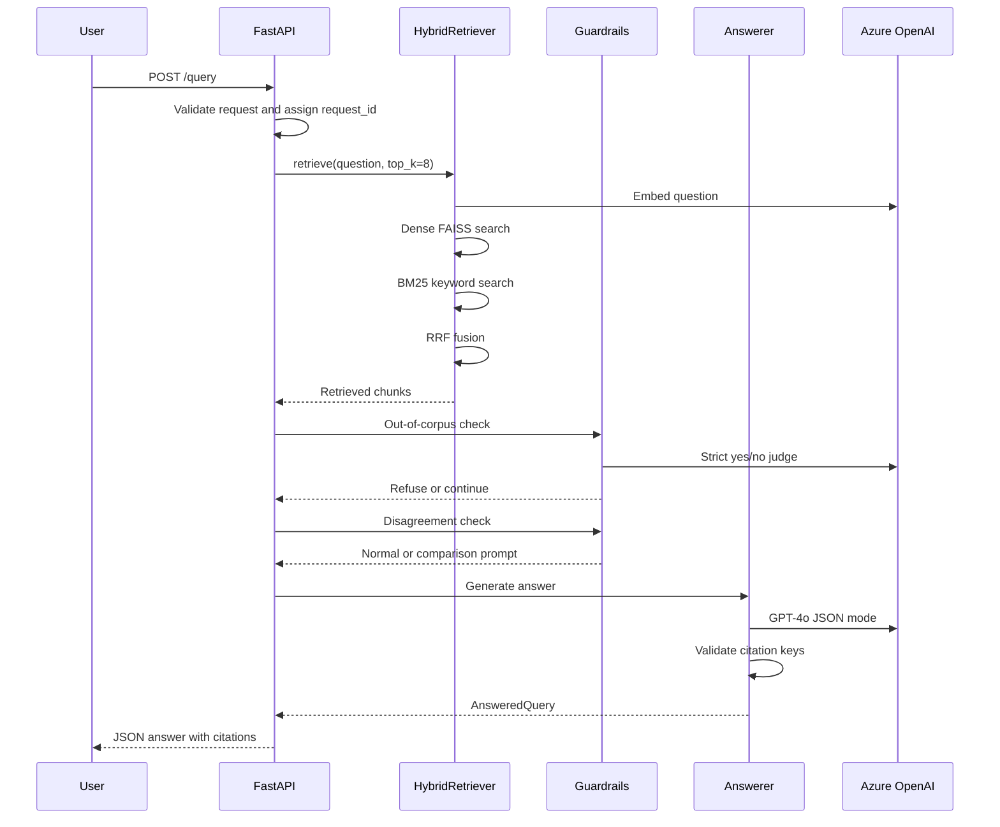
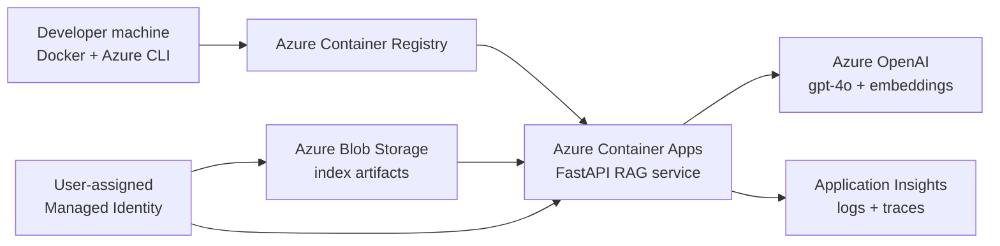

# Azure HR Policy RAG Assistant
### Production-shaped Retrieval-Augmented Generation over real HR handbooks


This is a complete HR policy RAG system built around two real employee handbooks: OpenGov Foundation in the US and Made Tech in the UK.

The application lets an employee ask a natural-language question like "How many sick days do I get?", retrieves relevant policy passages, generates a grounded answer with Azure OpenAI `gpt-4o`, returns citations, refuses questions outside the HR corpus, and explicitly calls out when the two handbooks disagree.

The runtime is a containerized FastAPI service designed for Azure Container Apps. The codebase keeps a clean separation between ingestion, retrieval, generation, guardrails, observability, and deployment concerns.

---

## Table of Contents

- [Short Abstract](#short-abstract)
- [Deep Introduction](#deep-introduction)
- [The Entire System Explained](#the-entire-system-explained)
- [Why Azure Matters Here](#why-azure-matters-here)
- [Retrieval And Generation Design](#retrieval-and-generation-design)
- [Quality Validation](#quality-validation)
- [Security And Operations](#security-and-operations)
- [Azure Deployment](#azure-deployment)
- [Quick Start](#quick-start)
- [Project Layout](#project-layout)
- [Key Decisions](#key-decisions)
- [Future Developments](#future-developments)

---

## Short Abstract

Most internal company policy bots fail in three predictable ways:

1. They confidently answer questions that are not in the policy documents.
2. They cite irrelevant chunks just because those chunks were retrieved.
3. They merge conflicting policies from different sources into one fake unified answer.

This project focuses on those failure modes directly.

It uses a hybrid retrieval stack: FAISS for semantic search, BM25 for keyword search, and Reciprocal Rank Fusion to combine both. It then uses guardrails before generation: an out-of-corpus detector to decide when to refuse, and a disagreement detector to decide when the answer should compare OpenGov and Made Tech instead of blending them.

The backend is production-shaped:

- FastAPI API with Pydantic contracts
- Azure OpenAI for embeddings and generation
- FAISS + BM25 indexes persisted to Azure Blob Storage
- Docker multi-stage production image
- Azure Container Apps deployment scripts
- Managed identity for Blob access
- Container Apps secrets for sensitive values
- Structured JSON logging
- Request IDs
- Azure Monitor OpenTelemetry
- Rate limiting on the public query endpoint
- Reproducible evaluation harness

The Azure deployment was successfully validated on a personal Azure subscription and then intentionally decommissioned to avoid ongoing credit spend.

---

## Deep Introduction

### The problem this project solves

HR policy questions sound simple, but they are surprisingly easy to answer badly.

An employee might ask:

- "How many sick days do I get?"
- "Can I work remotely?"
- "Who do I report misconduct to?"
- "What is the dental insurance plan?"

Those questions create different retrieval problems.

Some answers are straightforward and live in one source. Some need exact keyword matching, like FMLA or statutory sick pay. Some need semantic matching, where the employee says "ill" but the policy says "sick". Some should be refused because the corpus does not contain that information. And some are tricky because both OpenGov and Made Tech talk about the same topic, but with different rules.

That last case is especially important. A naive RAG system tends to average the two policies into a single answer. That is wrong. If OpenGov and Made Tech disagree, the assistant should say so clearly:

- Per OpenGov, the rule is X.
- Per Made Tech, the rule is Y.
- The difference is Z.

This project is built around that level of reliability rather than just "retrieve a chunk and ask an LLM".

### What makes this different from a simple document chatbot

This is not a one-file demo that uploads PDFs into a vector database and hopes for the best.

The system has a full retrieval lifecycle:

1. Load real markdown and PDF policy files.
2. Attach hardcoded source provenance from `CORPUS_SOURCES.md`.
3. Skip a duplicate consolidated PDF to avoid biased retrieval.
4. Chunk markdown and PDFs differently.
5. Embed chunks with Azure OpenAI `text-embedding-3-large`.
6. Persist the artifact layer as parquet, FAISS, and BM25.
7. Load indexes at startup locally or from Azure Blob Storage.
8. Retrieve with hybrid dense + lexical search.
9. Run out-of-corpus and disagreement guardrails.
10. Generate a JSON-mode answer with validated citations.

The result is small enough to understand end-to-end, but serious enough to show the shape of a real Azure AI service.

---

## The Entire System Explained

### 1. High-level architecture



The system has three layers:

**Data layer**
The HR corpus is loaded from local files, normalized into `RawDocument` records, split into chunks, embedded, and persisted as retrieval artifacts. The artifacts are small enough to load into memory, so there is no need to operate a separate vector database for this corpus size.

**Retrieval and reasoning layer**
Runtime questions are embedded and searched through FAISS. The same query is also tokenized through BM25. The two ranked lists are fused with Reciprocal Rank Fusion, then checked for out-of-corpus risk and source disagreement.

**API and operations layer**
FastAPI exposes `/query`, `/healthz`, and `/readyz`. The container is designed for Azure Container Apps, with secrets, managed identity, JSON logs, request IDs, Azure Monitor telemetry, and rate limiting.

### 2. Ingestion lifecycle



The corpus has 32 files, but only 31 are indexed. The OpenGov consolidated PDF is intentionally skipped because it duplicates the split markdown policies. Indexing it would make OpenGov content appear twice and bias retrieval.

The persisted retrieval layer contains:

| Artifact | Purpose |
|---|---|
| `embeddings.parquet` | Chunk metadata, text, token counts, provenance, and embeddings |
| `faiss.index` | L2-normalized dense vector index for inner-product search |
| `bm25.pkl` | Persisted lexical index using the same tokenizer as runtime retrieval |

### 3. Query lifecycle



The API returns:

```json
{
  "answer": "Per OpenGov ... Per Made Tech ...",
  "citations": [
    {
      "file_path": "sick-leave-policy.md",
      "source": "opengov",
      "chunk_idx": 0,
      "snippet": "..."
    }
  ],
  "retrieval_scores": [0.0325, 0.0314, 0.0307]
}
```

---

## Why Azure Matters Here

This project is deliberately Azure-first.

That matters because a lot of European companies already standardize on Microsoft infrastructure: Azure subscriptions, Entra ID, managed identities, Azure Monitor, private networking, and governance policies. A useful AI system in that environment should not just run locally. It should fit the way Azure teams actually operate.

The project uses Azure in the places where it matters:

| Azure Service | How it is used |
|---|---|
| Azure OpenAI | `gpt-4o` for answers and `text-embedding-3-large` for embeddings |
| Azure Container Apps | Serverless container hosting for the FastAPI app |
| Azure Container Registry | Stores the production Docker image |
| Azure Blob Storage | Stores FAISS, BM25, and parquet retrieval artifacts |
| Managed Identity | Lets the app read Blob artifacts without storage keys |
| Container Apps Secrets | Stores the Azure OpenAI key and App Insights connection string |
| Azure Monitor / App Insights | Receives OpenTelemetry traces, logs, and request telemetry |
| Azure Cost Management | Used during deployment testing with a budget alert |

The real Azure deployment was validated on a personal Azure subscription and later decommissioned intentionally to preserve Azure credits.

---

## Retrieval And Generation Design

### Corpus loader

Source attribution is explicit, not guessed from filenames. OpenGov and Made Tech files are stored in hardcoded sets from `CORPUS_SOURCES.md`. If an unknown file appears, ingestion fails loudly instead of silently assigning the wrong handbook.

That matters because disagreement detection depends on source provenance. A wrong source label would produce wrong answers.

### Chunking

Markdown and PDFs are treated differently:

| Format | Strategy |
|---|---|
| Markdown | Heading-aware chunking using H1-H3 breadcrumbs |
| PDF | Paragraph packing with page markers from form-feed boundaries |
| Tiny files | Kept as a single chunk |
| Long sections | Packed with token overlap |

Defaults:

| Setting | Value |
|---|---:|
| Max tokens | 800 |
| Overlap | 100 |
| Minimum section tokens | 50 |
| Tiny file threshold | 400 |

### Embeddings

The embedder wraps Azure OpenAI `text-embedding-3-large` and includes:

- batch embedding
- token counting
- token bucket rate limiting
- exponential backoff for rate limits and 5xx errors
- loud failure on non-retryable 4xx errors
- skip logic for single inputs above the model token limit

Vectors are not normalized in the embedder. Normalization is done in the indexer, where FAISS search semantics are defined.

### Indexing

The indexer builds three artifacts:

1. `embeddings.parquet`
2. `faiss.index`
3. `bm25.pkl`

FAISS uses `IndexFlatIP(3072)`. Embeddings are normalized with `faiss.normalize_L2()` before insertion so inner product behaves like cosine similarity.

BM25 tokenization is exported as `tokenize_for_bm25(text)` and imported by the retriever. This keeps index-time and query-time lexical tokenization identical.

### Hybrid retrieval

Dense retrieval is good for paraphrase. BM25 is good for exact keywords. The retriever runs both:

```text
query
  -> Azure embedding
  -> FAISS dense top 20
  -> BM25 lexical top 20
  -> Reciprocal Rank Fusion
  -> final top 8
```

RRF avoids mixing incompatible raw score scales. FAISS scores and BM25 scores live on different numeric ranges, but ranks are comparable.

### Guardrails

The system has two main guardrails.

**Out-of-corpus detector**
The system refuses only when both signals agree:

- max RRF score is below the threshold
- GPT-4o judge says the context is insufficient

This avoids refusing every short or unusual query while still blocking hallucinated policy answers.

**Disagreement detector**
If retrieved chunks contain both OpenGov and Made Tech content, the system compares source centroids. If both sources appear to be talking about the same topic, it injects a prompt instruction telling GPT-4o to present both rules separately.

### Generation

The answerer uses GPT-4o with:

- strict system prompt
- `temperature=0.0`
- JSON mode
- max token cap
- Pydantic parsing
- citation key validation

If GPT-4o returns a citation that was not actually in the retrieved context, the app drops that citation and logs a warning.

---

## Quality Validation

This project is tested at three levels:

1. Unit tests for ingestion, chunking, embedding, indexing, retrieval, guardrails, generation, and observability.
2. API tests with FastAPI `TestClient`.
3. Evaluation harness against realistic HR questions.

### Test suite

Latest local test run:

```text
75 passed, 1 skipped
```

The skipped test is the optional live OpenAI smoke test, which only runs when explicitly enabled.

### Evaluation harness

The evaluation runner posts each case to `/query`, records latency, answer, citations, retrieval scores, and status code, then computes:

- retrieval recall
- refusal match
- whether both sources are surfaced
- GPT-4o faithfulness score

The harness is reproducible:

```bash
python -m eval.run_eval \
  --base-url http://127.0.0.1:8000 \
  --test-set eval/test_set.json \
  --out eval/results.json \
  --report eval/results.md
```

### Core 40-case eval

| Metric | Bar | Result | Status |
|---|---:|---:|---|
| Retrieval recall | >= 0.85 | 0.982 | Met |
| Refusal accuracy | >= 0.90 | 1.000 | Met |
| Surfaces both sources | >= 0.75 | 1.000 | Met |
| Mean faithfulness | >= 0.80 | 0.964 | Met |

### Extended 62-case eval

| Metric | Bar | Result | Status |
|---|---:|---:|---|
| Retrieval recall | >= 0.85 | 0.920 | Met |
| Refusal accuracy | >= 0.90 | 0.984 | Met |
| Surfaces both sources | >= 0.75 | 0.786 | Met |
| Mean faithfulness | >= 0.80 | 0.898 | Met |

The extended eval is tougher. It includes more disagreement cases, more paraphrased queries, and adversarial prompts. The system still clears the stated quality bars.

### Known evaluation limitations

The eval is useful, but not magic:

- LLM-as-judge can have length preference and self-preference bias.
- Refusal matching is based on strings and can miss valid alternative wording.
- 40 or 62 cases are good regression checks, not statistically significant proof.
- Disagreement handling is threshold-based and should be calibrated on a larger set.

---

## Security And Operations

### Security posture

| Concern | Implementation |
|---|---|
| Secrets in repo | `.env` is ignored; `.env.example` contains placeholders only |
| Secrets in image | `.env` is excluded by `.dockerignore` |
| OpenAI key | Stored as Container Apps secret |
| App Insights connection string | Stored as Container Apps secret |
| Blob access | Managed identity with Blob Data Reader |
| Storage keys | Not used by the running app |
| Public query endpoint | Rate limited |
| Container user | Non-root `appuser` with UID 10001 |
| Logs | No raw question text or answer text logged |

### Health checks

| Endpoint | Purpose |
|---|---|
| `/healthz` | Fast liveness check, does not call Azure OpenAI |
| `/readyz` | Readiness check, confirms Azure OpenAI is reachable |
| `/query` | Main RAG endpoint |

### Observability

The app emits structured JSON logs with:

- timestamp
- level
- logger
- request ID
- event name
- route
- status code
- duration
- question hash, not question text
- retrieved chunk count
- out-of-corpus decision fields
- disagreement decision fields
- citation count

Azure Monitor OpenTelemetry is enabled when `APPLICATIONINSIGHTS_CONNECTION_STRING` is set. Locally it no-ops cleanly.

### Rate limiting

`POST /query` is protected by a small in-memory rolling-window limiter:

```text
RATE_LIMIT_ENABLED=true
RATE_LIMIT_REQUESTS=20
RATE_LIMIT_WINDOW_SECONDS=60
```

Health and readiness endpoints are not rate limited so platform probes keep working.

---

## Azure Deployment

The project includes Azure deployment scripts under `deploy/`.

```text
deploy/
|-- setup-storage.sh   Create StorageV2 account and private Blob container
|-- setup-rbac.sh      Create managed identity and assign Blob reader role
|-- deploy-stub.sh     Deploy a minimal FastAPI stub
|-- deploy.sh          Deploy the full RAG app to Azure Container Apps
```

The intended production-ish Azure shape:



The real app was deployed and smoke-tested on a personal Azure subscription:

- `/healthz` returned 200
- `/readyz` returned 200
- `/query` returned real RAG answers with citations
- Container Apps secret refs were verified
- managed identity access was verified
- Azure Monitor telemetry was verified
- rate limiting was deployed

The deployment has since been deleted to avoid spending Azure credits.

### Deploy from scratch

```bash
# 1. Create StorageV2 account and private rag-index container
bash deploy/setup-storage.sh

# 2. Build and optionally upload retrieval artifacts
python -m app.ingest

# 3. Create managed identity and assign Blob reader access
bash deploy/setup-rbac.sh

# 4. Build and deploy the full RAG app
bash deploy/deploy.sh
```

## Quick Start

### 1. Create environment

```bash
conda create -n rag python=3.11
conda activate rag
pip install -r requirements.txt
```

### 2. Configure environment

```bash
cp .env.example .env
```

Fill:

```text
AZURE_OPENAI_ENDPOINT=<your-endpoint>
AZURE_OPENAI_KEY=<your-key>
AZURE_OPENAI_API_VERSION=2024-10-21
AZURE_OPENAI_CHAT_DEPLOYMENT=gpt-4o
AZURE_OPENAI_EMBEDDING_DEPLOYMENT=text-embedding-3-large
BLOB_ACCOUNT_URL=https://<storage-account>.blob.core.windows.net
BLOB_INDEX_CONTAINER=rag-index
INDEX_BLOB_PREFIX=latest
INDEX_LOCAL_DIR=data/index
APPLICATIONINSIGHTS_CONNECTION_STRING=
RATE_LIMIT_ENABLED=true
RATE_LIMIT_REQUESTS=20
RATE_LIMIT_WINDOW_SECONDS=60
```

### 3. Build index

```bash
python -m app.ingest
```

### 4. Run API

```bash
uvicorn app.main:app --host 127.0.0.1 --port 8000
```

### 5. Try a query

```bash
curl -X POST http://127.0.0.1:8000/query \
  -H "Content-Type: application/json" \
  -d "{\"question\":\"How many sick days do I get?\"}"
```

### 6. Run tests

```bash
pytest
```

---

## Project Layout

```text
.
|-- app/
|   |-- api/              FastAPI routes
|   |-- generation/       GPT-4o prompt and answerer
|   |-- guardrails/       Out-of-corpus and disagreement detectors
|   |-- ingest/           Loader, chunker, embedder, indexer, Blob store
|   |-- observability/    JSON logs, request IDs, telemetry, rate limiting
|   |-- retrieval/        Hybrid retriever and SDK adapter
|   |-- config.py         Pydantic settings
|   |-- main.py           App factory and startup wiring
|
|-- corpus/               OpenGov and Made Tech policy files
|-- data/index/           Local retrieval artifacts
|-- deploy/               Azure CLI deployment scripts
|-- eval/                 Test sets, eval runner, reports
|-- sdk/                  Reference SDK modules and supporting template code
|-- tests/                Pytest suite
|-- CORPUS_SOURCES.md     Source mapping and corpus notes
|-- Dockerfile            Multi-stage production container
|-- requirements.txt      Pinned dependencies
```

Key implementation files:

| File | Role |
|---|---|
| `app/main.py` | FastAPI factory, lifespan startup, dependency wiring |
| `app/api/query.py` | End-to-end query flow |
| `app/ingest/loader.py` | Explicit corpus loading and source attribution |
| `app/ingest/chunker.py` | Markdown and PDF chunking |
| `app/ingest/embedder.py` | Azure OpenAI embedding wrapper |
| `app/ingest/indexer.py` | FAISS, BM25, and parquet artifact builder |
| `app/retrieval/retriever.py` | Hybrid retrieval with RRF |
| `app/generation/answerer.py` | GPT-4o answer generation and citation validation |
| `app/guardrails/out_of_corpus.py` | Refusal decision logic |
| `app/guardrails/disagreement.py` | Multi-source disagreement detection |
| `app/observability/rate_limit.py` | Query rate limiter |

---

## Key Decisions

The main implementation choices:

| Decision | Choice |
|---|---|
| Compute target | Azure Container Apps |
| API framework | FastAPI |
| Vector store | FAISS in memory, persisted to Blob |
| Lexical retrieval | BM25 |
| Fusion | Reciprocal Rank Fusion |
| Embeddings | Azure OpenAI `text-embedding-3-large` |
| Generation | Azure OpenAI `gpt-4o` |
| Markdown chunking | Heading-aware with breadcrumbs |
| PDF chunking | Paragraph packing with page markers |
| Out-of-corpus | RRF score threshold + GPT-4o judge |
| Disagreement | Source split + centroid similarity + prompt branch |
| Secrets | Container Apps secrets |
| Blob auth | Managed identity |
| Observability | JSON logs + Azure Monitor OpenTelemetry |

---

## Future Developments

If I continued this project, I would focus on making it closer to a long-lived internal enterprise service.

### 1. Authentication and access control

Add Entra ID authentication or OAuth2/JWT middleware so `/query` is not public. For an internal HR assistant, identity matters because access can depend on employee location, department, and handbook scope.

### 2. Key Vault integration

Move from Container Apps secrets to Azure Key Vault references. Container Apps secrets are good for a small deployment, but Key Vault gives better central rotation, audit trails, and separation of duties.

### 3. Private networking

Use private endpoints for Blob Storage and Azure OpenAI where the Azure subscription allows it. That would make the architecture better aligned with enterprise Azure environments in Europe.

### 4. Larger evaluation set

Expand the eval set from 40 and 62 cases to 100+ cases. Add more adversarial cases, more disagreement cases, and more short ambiguous questions.

### 5. Reranking

Add a cross-encoder reranker over the fused top 20 chunks. Hybrid retrieval already works well, but reranking would improve precision for source-disagreement questions.

### 6. Better threshold calibration

Calibrate out-of-corpus and disagreement thresholds using a larger distribution of in-corpus, adjacent, and clearly out-of-corpus questions.

### 7. Chunking experiments

Run chunk-size sweeps across:

```text
400/50
600/75
800/100
1000/125
```

Then compare recall, faithfulness, latency, and disagreement surfacing.

### 8. UI layer

Build a small internal HR assistant UI with:

- question box
- answer panel
- citation drawer
- source comparison view
- feedback buttons
- request ID display for support/debugging

### 9. CI/CD

Add GitHub Actions for:

- ruff
- pytest
- Docker build
- eval smoke run
- Azure deploy dry run

### 10. Production dashboards

Add App Insights workbooks or Grafana dashboards for:

- query volume
- refusal rate
- disagreement rate
- OpenAI latency
- citation count
- answer parse errors
- rate-limit events

---

## References

- Azure Container Apps: https://learn.microsoft.com/azure/container-apps/
- Azure OpenAI Service: https://learn.microsoft.com/azure/ai-services/openai/
- Azure Managed Identity: https://learn.microsoft.com/azure/container-apps/managed-identity
- Azure Monitor OpenTelemetry: https://learn.microsoft.com/azure/azure-monitor/app/opentelemetry-enable
- FAISS: https://github.com/facebookresearch/faiss
- Rank BM25: https://github.com/dorianbrown/rank_bm25
- FastAPI: https://fastapi.tiangolo.com/
